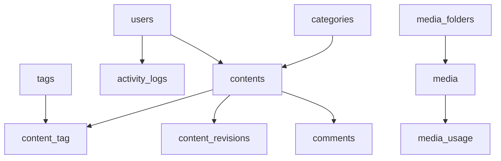

# Migration Documentation

## Overview

JA-CMS uses Laravel migrations for database schema management. Total: 57 migrations.

## Core Migrations

| Migration | Table | Description |
|-----------|-------|-------------|
| 0001_01_01_000000 | users | Base user table |
| 0001_01_01_000001 | cache | Laravel cache table |
| 0001_01_01_000002 | jobs | Queue jobs table |

## Content Management

| Migration | Table | Description |
|-----------|-------|-------------|
| 2025_11_13_184358 | contents | Main content table |
| 2025_11_13_184358 | categories | Category hierarchy |
| 2025_11_13_184358 | tags | Content tags |
| 2025_11_13_184358 | media | Media files |
| 2025_11_13_184530 | content_tag | Pivot table |
| 2025_11_13_185530 | comments | Content comments |
| 2025_11_14_113512 | content_revisions | Version history |

## Known Duplicate Migrations

> [!WARNING]
> The following migrations are duplicates and may cause issues on fresh installs.
> One of each pair may fail if the column already exists.

| First | Second | Column/Table |
|-------|--------|--------------|
| 2025_11_14_113619 | 2025_11_14_183500 | `locked_by` on contents |
| 2025_11_14_120003 | 2025_11_14_184000 | `parent_id` on categories |

### Handling Duplicate Migrations

Both duplicate pairs use `hasColumn()` checks to prevent errors:

```php
// Safe pattern used in duplicate migrations
if (!Schema::hasColumn('table', 'column')) {
    Schema::table('table', function (Blueprint $table) {
        $table->column()->nullable();
    });
}
```

## Migration Dependencies



## Extension Migrations

| Category | Migrations |
|----------|------------|
| Forms | forms, form_fields, form_submissions |
| Analytics | analytics_visits, analytics_events, analytics_sessions |
| Search | search_indexes, search_queries |
| i18n | languages, translations |
| System | settings, email_templates, notifications |

## Commands

```bash
# Fresh install
php artisan migrate:fresh --seed

# Check migration status
php artisan migrate:status

# Run pending migrations
php artisan migrate

# Rollback last batch
php artisan migrate:rollback
```
