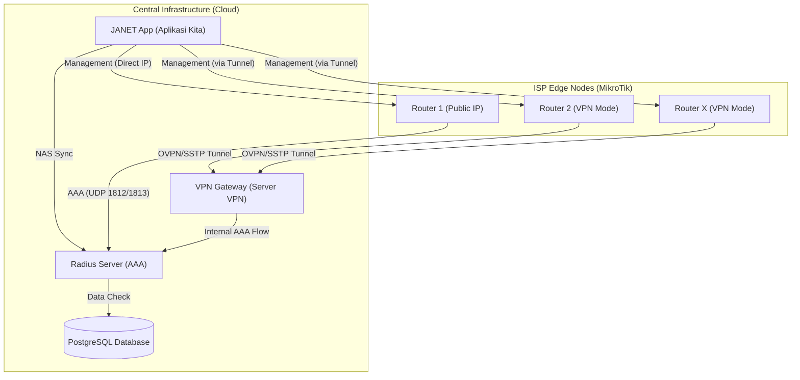

# JANET System Topology

This document describes the network architecture and data flow between the central management system (JANET), Radius server, and various MikroTik router deployment modes.

## Topology Diagram

## Description

1.  **JANET App**: The central brain of the system. It handles router management, NAS synchronization to the Radius server, and real-time monitoring via API.
2.  **Radius Server**: Handles AAA (Authentication, Authorization, and Accounting) for PPPoE and Hotspot users. It queries the JANET database to validate credentials.
3.  **VPN Gateway**: A management tunnel server for routers that do not have a public IP. It allows bidirectional communication between the central JANET and private edge nodes.
4.  **Static Mode (R1)**: Routers with a direct Public IP. They communicate directly with the Radius server and CMS.
5.  **VPN Mode (R2/RX)**: Routers behind NAT or private IPs. They use OVPN/SSTP/L2TP to connect to the central VPN server, enabling remote management and Radius AAA flow.
